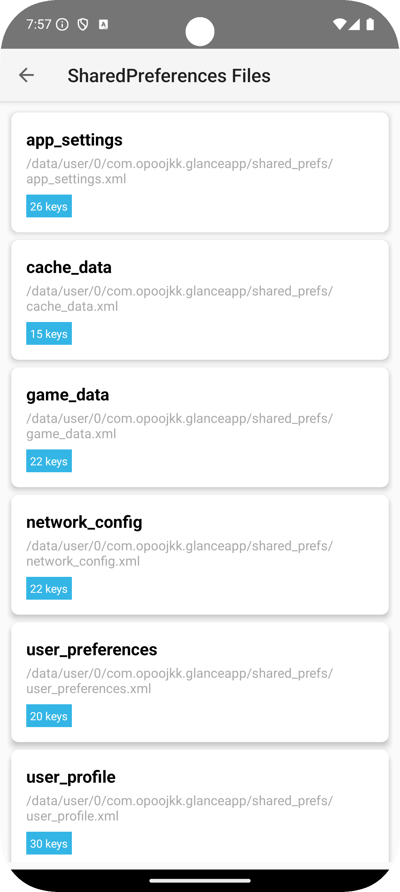
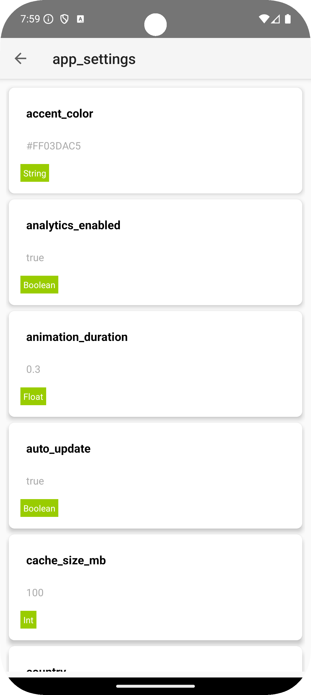

## GlanceSP

### 简介
一个轻量的 Android SharedPreferences 查看与管理库，零额外三方依赖，API 简洁易用。

### 通过 JitPack 集成
1) 在 `settings.gradle.kts` 的 `dependencyResolutionManagement` 中添加仓库：
```kotlin
dependencyResolutionManagement {
	repositoriesMode.set(RepositoriesMode.FAIL_ON_PROJECT_REPOS)
	repositories {
		mavenCentral()
		maven { url = uri("https://jitpack.io") }
	}
}
```

2) 添加依赖（将版本替换为最新 tag，当前为 `0.0.2`）：
```kotlin
dependencies {
	debugImplementation("com.github.opoojkk:glancesp:0.0.2")
}
```

3) 打开GlanceSP名称的icon

更多版本信息与使用说明参见 JitPack：[opoojkk/glancesp on JitPack](https://jitpack.io/#opoojkk/glancesp)


### 截图

- **sp文件列表**



- **sp key value列表**



